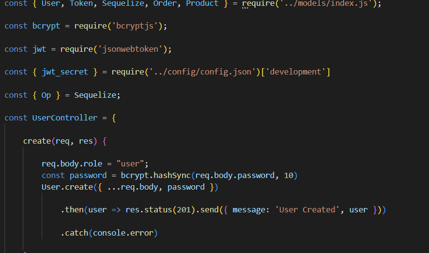
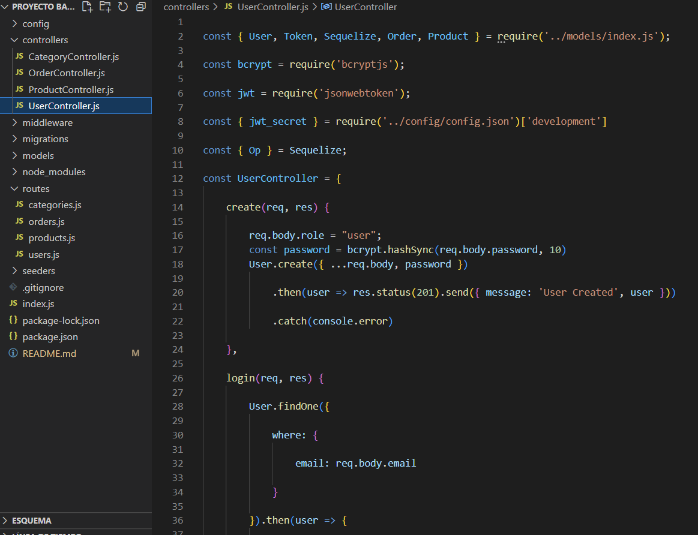
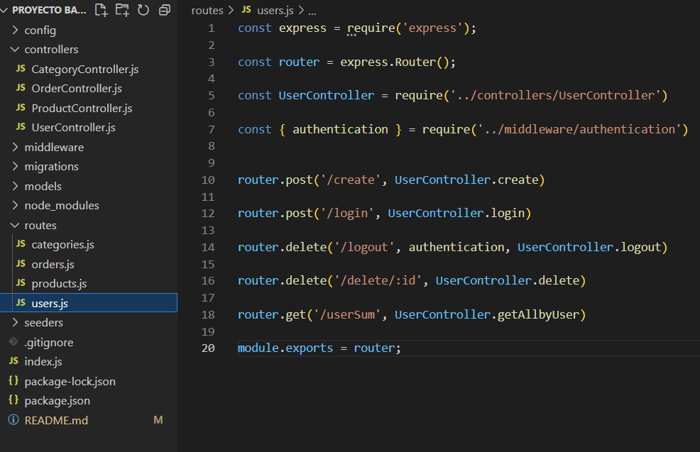
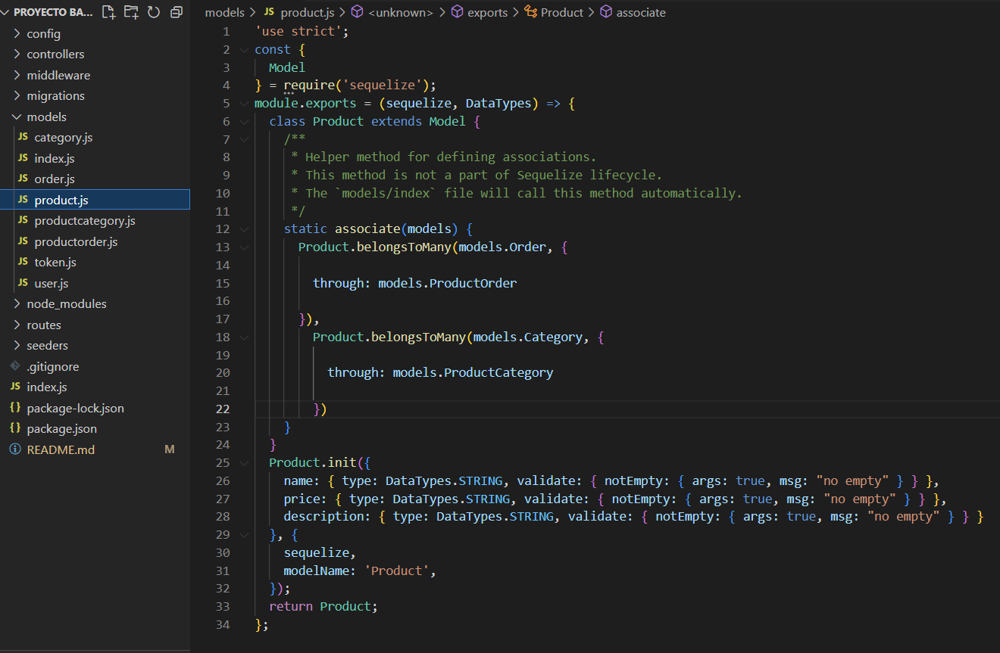
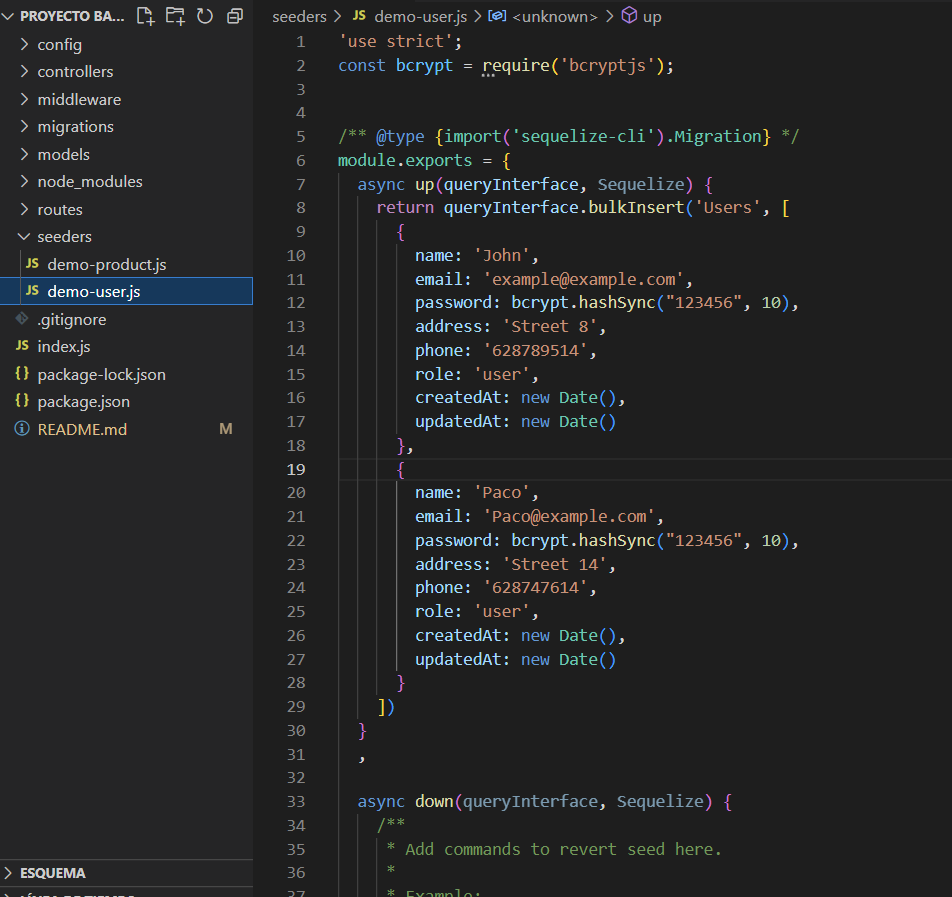

<h1 align="center"> BACKEND PROJECT <project-name></h1>

## Introduction 🚀

This project has been made using node + express, moreover mysql + sequelize.
It is about an e-commerce, exactly is the backend of the online shop.

 

It is based on this diagram for set the database and the relations of the tables with sequelize.

## Estructure 🛠️

 

The project contains different points:
- Users registered using Bcrypt.

The users registered will have his password crypted by Bcrypt.

- Users login + Token + Middleware.

The login will generate a token that will keep the user's session up.

- CRUD endpoints.

We will work with the CRUD enpoints set in the routes and controllers folders. In the routes we will set the endpoint and in the controllers
we setup the logic for these endpoints.

- Different relations many to many and one to many.

The relations between the tables can be found in the models. These models plus the migrations folder generate the tables in the database.

- Seeders use.
  
There are also some seeders prepared for help the user testing the database.

   
  
  ## Social Networks 👨‍💻️
  
Sergio Cano  ➡      
     
       
Sergio Juan Vidal  ➡      
     

   
  
## License 📄
  
 
  
This project is under license of Sergio Cano and Sergio Juan Vidal.
  
---
👨‍💻️ Done by [sergiokano](https://github.com/sergiokano) and [Sergio Juan Vidal](https://github.com/SergioJ-Vidal) 
